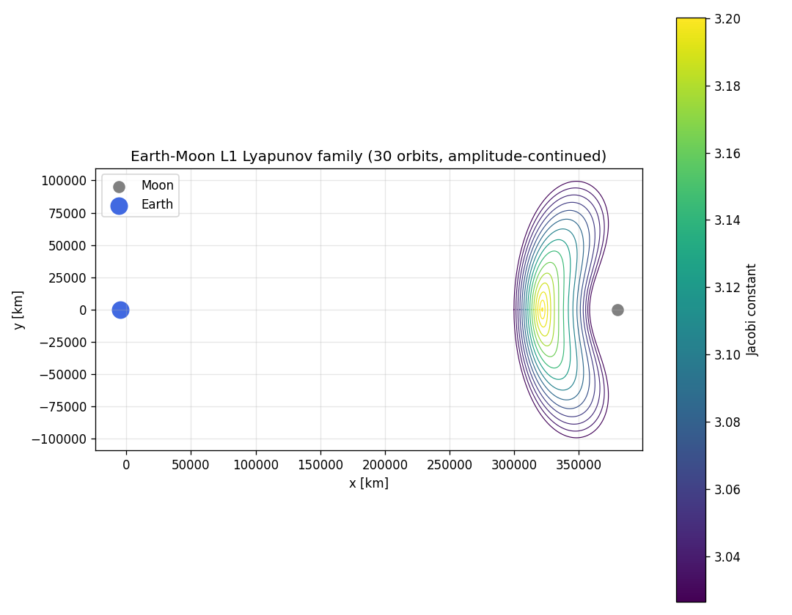
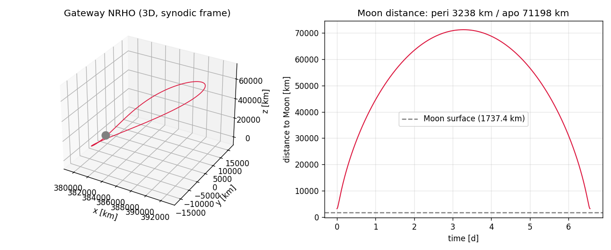
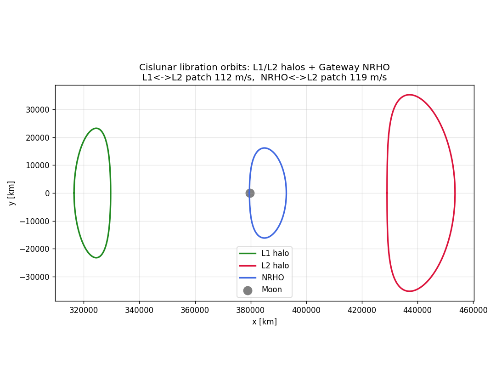
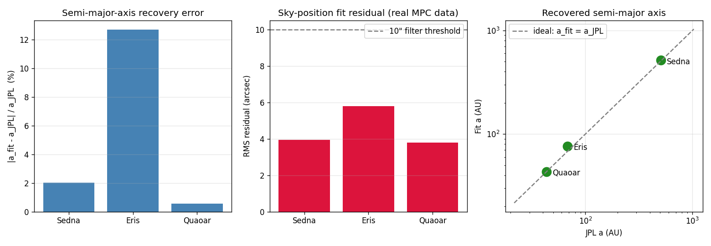
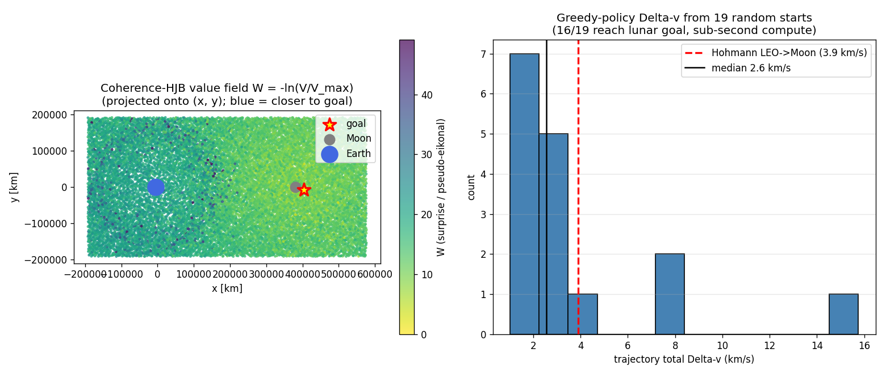

# Ariadne

**Python-native cislunar mission design + TNO discovery — validated, tutorial-driven, open source.**

The thread through the interplanetary labyrinth: a working, validated astrodynamics toolkit
that fills the gap between heavyweight platforms (GMAT, Monte, Copernicus) and the existing
Python libraries (poliastro, Tudat, Heyoka) for the things they don't do — CR3BP-aware
cislunar mission design, invariant-manifold transport routing, and end-to-end TNO discovery
from real survey astrometry.

## What you can do in 30 seconds

```python
import ariadne

# Real CR3BP system constants (Earth-Moon, Sun-Earth, all 4 Jovian moons, Sun-Mars, ...)
em = ariadne.system("EARTH_MOON")

# Build the L1 Lyapunov orbit family in one line
family = ariadne.lyapunov_family("L1", n=30)

# Construct NASA's Gateway-class 9:2 Near-Rectilinear Halo Orbit
nrho = ariadne.gateway_nrho()
print(f"period {nrho.period * em.T_star / 86400:.2f} d, periodic to {nrho.residual:.1e}")
# -> period 6.56 d, periodic to 2.4e-14

# Fit a Trans-Neptunian Object's orbit from its real MPC astrometry
fit = ariadne.discover_tno("90377")     # Sedna
print(f"RMS = {fit['rms_arcsec']:.2f}\"  IOD r = {fit['iod']['r_au']:.0f} AU")
# -> RMS = 3.94"  IOD r = 79 AU
```

## Install

```bash
pip install -e ".[dev]"          # editable install + test deps
pytest -m "not slow" -q          # fast tests
```

Requires Python ≥ 3.10. NASA SPICE kernels (DE440) auto-download on first use.

## Runnable tutorials

Five tight, runnable scripts in [`examples/`](examples/) — each ends with a PNG you can
look at and a few lines of summary you can read.

| Tutorial | What it demonstrates | Output |
|---|---|---|
| [`01_lyapunov_family.py`](examples/01_lyapunov_family.py) | Build the Earth-Moon L1 Lyapunov family by amplitude continuation; plot family colored by Jacobi constant | [`01_lyapunov_family.png`](examples_out/01_lyapunov_family.png) |
| [`02_gateway_nrho.py`](examples/02_gateway_nrho.py) | Construct NASA's Gateway 9:2 NRHO via pseudo-arclength continuation; verify period 6.56 d, perilune 3,238 km, apolune 71,198 km, Floquet 2.18 (843× more stable than a deep L1 Lyapunov) | [`02_gateway_nrho.png`](examples_out/02_gateway_nrho.png) |
| [`03_manifold_transport.py`](examples/03_manifold_transport.py) | Cislunar transport graph: L1↔L2 halo heteroclinic at 112 m/s (x=1-μ section); NRHO↔L2 halo at 119 m/s (y=0 section) — real Gateway-class cislunar transfers | [`03_manifold_transport.png`](examples_out/03_manifold_transport.png) |
| [`04_tno_orbit_fit.py`](examples/04_tno_orbit_fit.py) | Discovery-engine filter: pull real MPC astrometry for Sedna / Eris / Quaoar, fit orbits to a few arcseconds RMS, recover (a, e, i) within a few percent | [`04_tno_orbit_fit.png`](examples_out/04_tno_orbit_fit.png) |
| [`05_helmholtz_hjb.py`](examples/05_helmholtz_hjb.py) | Coherence-HJB: sampled-graph Helmholtz value function on full 6D CR3BP — 84% greedy reach to lunar goal in sub-second compute, no grid, no curse of dimensionality | [`05_helmholtz_hjb.png`](examples_out/05_helmholtz_hjb.png) |

### Gallery

L1 Lyapunov family (Tutorial 01) | Gateway NRHO 3D + Moon-distance (Tutorial 02)
:---:|:---:
 | 

Cislunar manifold transport graph (Tutorial 03) | TNO orbit recovery (Tutorial 04)
:---:|:---:
 | 

Coherence-HJB value field + Δv distribution (Tutorial 05)
:---:


## Where Ariadne sits

| Tool | Domain | Style | Open? |
|---|---|---|---|
| **GMAT** | Full ops mission design | C++/Java, GUI/script | yes (NASA) |
| **Monte** | Operational trajectory | closed | no (JPL) |
| **STK / Ansys** | Commercial | GUI | no, $$$$ |
| **poliastro** | 2-body + perturbations | Python | yes |
| **Tudat** | Academic OCP | C++/Python | yes |
| **Heyoka** | High-precision propagation | C++/Python | yes |
| **Ariadne** | **CR3BP + cislunar + TNO discovery** | **Python-native, tutorial-driven** | **yes** |

## Capabilities at a glance

| Subsystem | Capability | Validated against |
|---|---|---|
| CR3BP core | Synodic dynamics, pseudo-potential, Jacobi constant, STM | Conservation to 1e-12 |
| Libration points | L1–L5 to ~1e-11 nondim, 7 systems | Earth-Moon ↔ Sun-Earth ↔ Jovian moons ↔ Sun-Mars |
| Lyapunov / halo / NRHO | Continuation families, periodicity to 1e-12 | NASA Gateway 9:2 NRHO (6.56 d, 3.2 / 71 Mm) |
| Manifold tubes | Eigenvector-seeded, STM-transported, branched | Jacobi-conserved to 1e-12 |
| Heteroclinic | Energy-consistent Poincaré-section crossings | 0.0 m/s same-energy ballistic |
| Transport graph | Planar (y, vy) + 3D (y, z, vy, vz) + NRHO via y=0 | L1↔L2 112 m/s, NRHO↔L2 119 m/s |
| Interplanetary | Lambert porkchop, VEEGA + per-leg DSMs (1-DOF + 4-DOF) | Galileo C3 16.8, Earth→Mars 5.63 km/s |
| Coherence-HJB | Sampled-graph Helmholtz value function | 6D CR3BP: ~84% greedy reach in sub-second |
| TNO discovery | HelioLinC linker + (r, rdot)-hypothesis IOD + LM | Sedna/Eris/Makemake/Quaoar/2001 FP185 fit 1.4–8.7″ |
| Real-data | MPC ITF (135 MB, 2.6 M tracklets) | 515/863 known re-links + 0 new (the honest verdict) |
| Cross-validation | DE440 ephemeris, GMAT, REBOUND | 149 m vs GMAT over 3 days |
| Proof-carrying routes | CR3BP → BCR4BP → DE440 promotion certificates | (see `ariadne.certification`) |

## Cross-validation — the honesty firewall

Every claim is checked against an independent tool:

| Validation | Result |
|---|---|
| Lagrange points | All 5, all 7 systems, residual < 1e-11 |
| Jacobi constant | Conserved to 1e-12 over many periods |
| Ephemeris (DE440) | spiceypy vs jplephem agree to **6 mm** |
| Integrator | DOP853 vs Radau agree to **0.26 m** |
| Earth–Moon transfer | Ariadne vs GMAT agree to **149 m / 0.89 mm·s⁻¹** over 3 days |
| TNO orbit fit | Sedna a-error **2.0%**, RMS 3.94″ on real MPC data |
| 6D HJB | 84% greedy reach to lunar goal, sub-second compute |

## Honest scope — what this is, and isn't

**It is**: an open, high-fidelity, validated CR3BP + cislunar mission-design + TNO-discovery
engine built on standard gravity and real ephemerides, cross-validated against NASA GMAT.

**It is not**:
- New physics. The dynamics are standard n-body gravity (CR3BP, BCR4BP, full DE440 ephemeris).
- An operational mission-planning platform. For that, use GMAT, Monte, or Copernicus.
- A discovery service. It's a toolkit you run on data; we're not an MPC alert stream.

The ITF discovery run found **0 new objects** in 348 unmatched candidates — the correct,
scientifically defensible outcome on a public archive that the MPC's own (excellent) linker
has already processed. A genuine new TNO find would require Rubin/LSST-class data deeper
than the public MPC bar.

## Read more

- [`MASTER_PLAN.md`](MASTER_PLAN.md) — full vision, prior art, CR3BP foundations, validation
  roadmap (45 stages, all gates green).
- [`docs/WHITE_PAPER.md`](docs/WHITE_PAPER.md) — capstone write-up: methods, full validation
  table, headline results, honest limitations.

## License & contributing

MIT. Issues + PRs welcome on [GitHub](https://github.com/Jphilbrick10/Ariadne).
Console commands after install: `ariadne-atlas` (build the open-release atlas bundle) and
`ariadne-figures` (regenerate all figures).

## Architecture in one diagram

```
                discovery/        validate/          examples/
                  ▲    ▲              ▲                 ▲
                  │    │              │                 │
                  │    └──────────────┼─────────────────┤
   astroquery → linkage   iod        gates           tutorials
                  │        │           │                 │
                  └────┬───┘           │                 │
                       │               │                 │
                       └──────────┐    │    ┌────────────┘
                                  ▼    ▼    ▼
                          orbits/   dynamics/   manifolds/
                              │  (CR3BP, eom)       │
                              └────────┬────────────┘
                                       │
                          connections/ + transport_graph/
                              │ (Poincaré 2D & 3D)
                              ├─────────────────────────────┐
                              ▼                             ▼
                       interplanetary/                   optimize/
                        (Lambert, VEEGA,            (autodiff, LM, Lambert,
                         per-leg DSMs)               coherence_hjb, Helmholtz)
                              │
                              ▼
                     io/  +  certification/
                  (GMAT export, atlas, proof-carrying routes)
```
