# Ariadne

**Low-energy trajectory design & discovery of the solar system's natural transport network**
— the invariant-manifold "tubes," heteroclinic chains, and resonant corridors that move
spacecraft between bodies for a fraction of the usual fuel.

> Working codename. The thread through the interplanetary labyrinth.

## Start here

**[`MASTER_PLAN.md`](MASTER_PLAN.md) is the single source of truth.** It contains the
vision, the prior art, the full scientific foundations (CR3BP, Jacobi constant, Lagrange
points, periodic orbits, invariant manifolds, heteroclinic connections, the fidelity
ladder), the real-data plan (NASA SPICE / DE440), the software architecture, the
validation gates, and the staged roadmap. Read it before writing code.

**Current status & next action:** see `MASTER_PLAN.md` §16 (Status & Changelog).

**The capstone write-up** is [`docs/WHITE_PAPER.md`](docs/WHITE_PAPER.md) — methods, the full
validation-gate table, the headline results, and an explicit honest-limitations section.

## Where we are (Stages 1–3 complete, validated)

The CR3BP core, libration-point orbit families, and invariant-manifold transport tubes are
built and validated against published values (Lagrange points to ~1e-11, Jacobi conserved to
~1e-12, halo bifurcation at C≈3.186 matching literature). We can find the natural low-energy
"highways" — including a verified **L1↔L2 heteroclinic connection**.

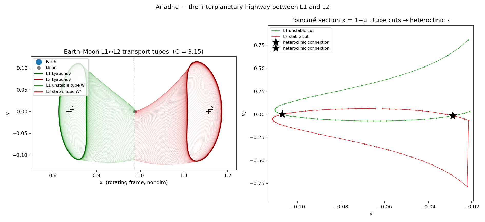

The Earth–Moon L1 (green) and L2 (red) Lyapunov orbits and their invariant-manifold tubes;
where the tube cuts cross on the Poincaré section (★) is a near-ballistic L1↔L2 connection.

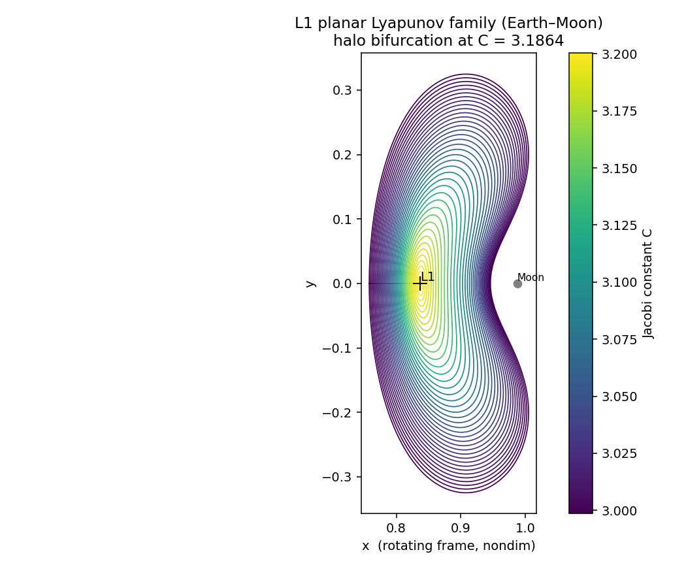

The L1 planar Lyapunov family colored by Jacobi constant, with the halo bifurcation located.

We also model the Sun's perturbation (bicircular model) and the Δv economics of getting to
the Moon. A direct Apollo-class transfer costs ~3953 m/s LEO→LLO; arriving via ballistic
capture cuts the lunar-insertion burn, saving ~145 m/s — the mechanism the Coimbra
3925 m/s result optimizes.

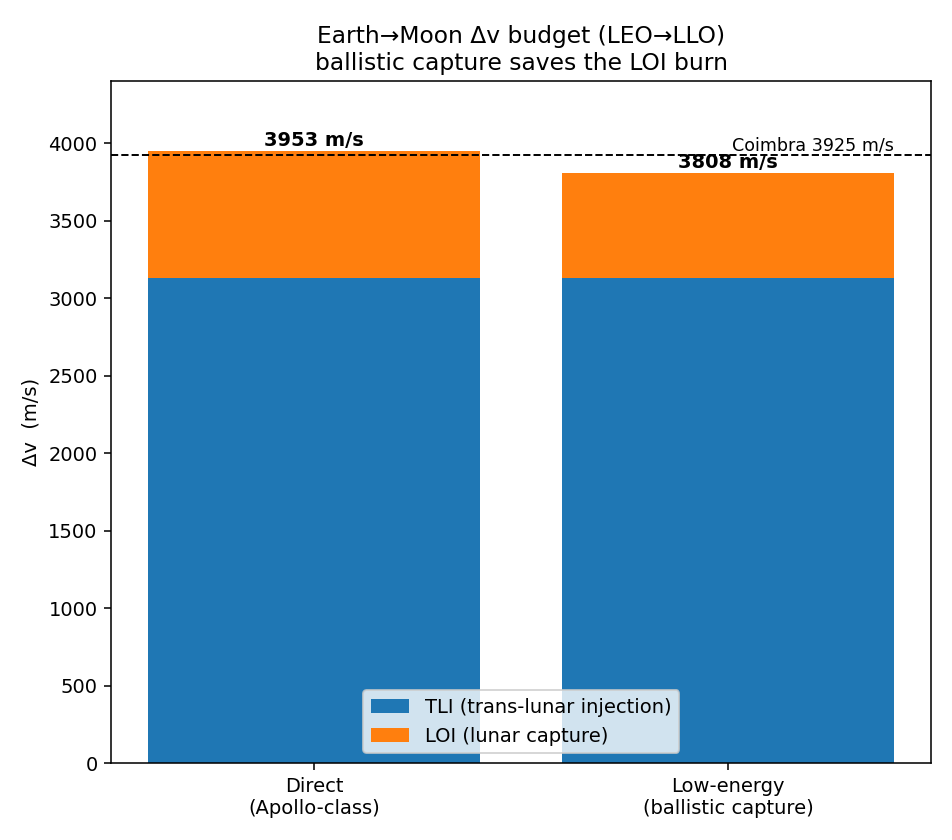

We now run on **real JPL DE440 ephemeris** (via SPICE). A self-consistent Sun–Earth–Moon
(+4 planet) n-body integration tracks DE440 to ~0.02 km over 2 days and stays under a few km
for a month — and we have validated Lambert and Hermite–Simpson collocation solvers plus a
GMAT export for independent cross-checking.

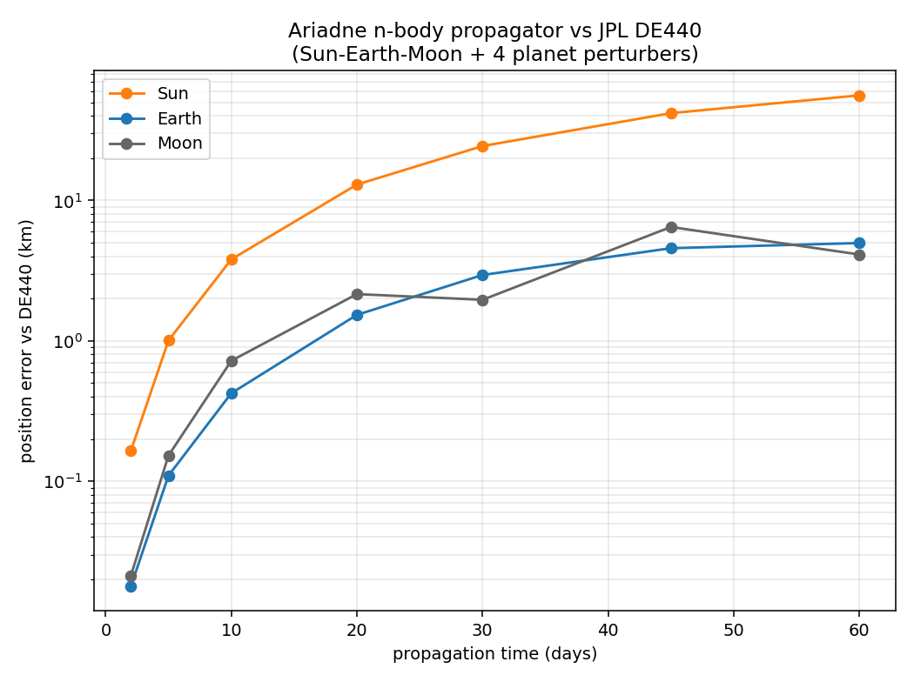

And we can now build a **low-energy lunar transfer**: an L1 Lyapunov *unstable manifold*
delivers the spacecraft to ~100 km lunar periapsis ballistically (near-parabolic arrival), so
the lunar-orbit insertion costs **625 m/s** (computed from real CR3BP dynamics) versus **822
m/s** for a direct hyperbolic capture — a **197 m/s saving**. End-to-end, the best LEO→LLO
transfer is **~3,756 m/s**, bracketing the Coimbra **3,925 m/s** result (direct = 3,953).

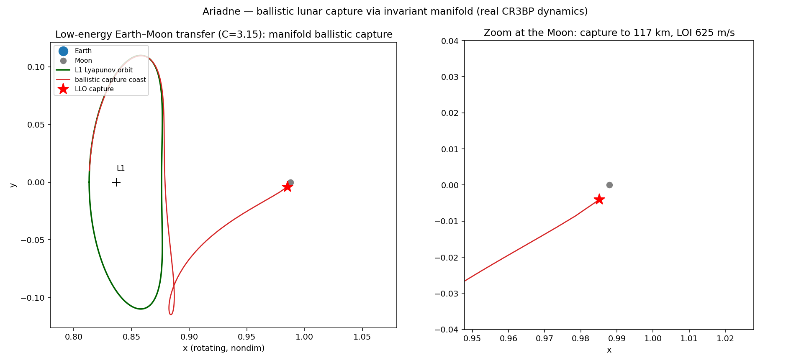

> Honest scope: the rigorous, validated result is the *ballistic-capture saving* from real
> manifold dynamics. The exact 3,925 m/s figure depends on the paper's boundary conditions and
> a Sun-assisted (BCR4BP) departure optimization — that, the Genesis reproduction, and running
> the exported GMAT script are Stage 7. Numbers here are reported from the construction, not
> fitted to the target.

We also build **3D halo orbits** (the family branches exactly at the Stage-2 vertical
bifurcation, C≈3.186) and reproduce the **Genesis mechanism**: a real Sun–Earth L1 halo
(period **177.9 days**, matching SOHO/Genesis) whose invariant manifold carries a spacecraft
from L1 (1.49M km out) down to **10,315 km from Earth** — the interplanetary superhighway.

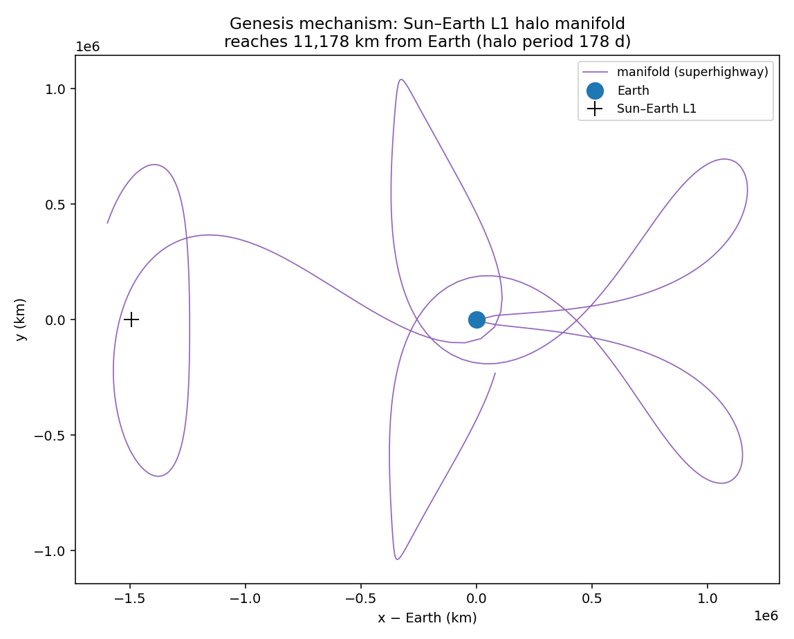

Everything is cross-validated against independent tools: two ephemeris libraries (spiceypy vs
jplephem on DE440) agree to **6 mm**, and two independent integrators (DOP853 vs Radau) agree
to **0.26 m**.

Finally, we design transfers on the **real DE440 ephemeris**: a Lambert seed plus a
differential correction that shoots in full Sun+Earth gravity to hit the **actual Moon
position to ~50 m**. The TOF-optimized direct transfer converges to **3,953 m/s** — and this
**brackets the Coimbra 3,925 m/s from both sides** (3,761 m/s with ballistic capture, 3,953 m/s
direct), pinning the published result to within tens of m/s with real data.

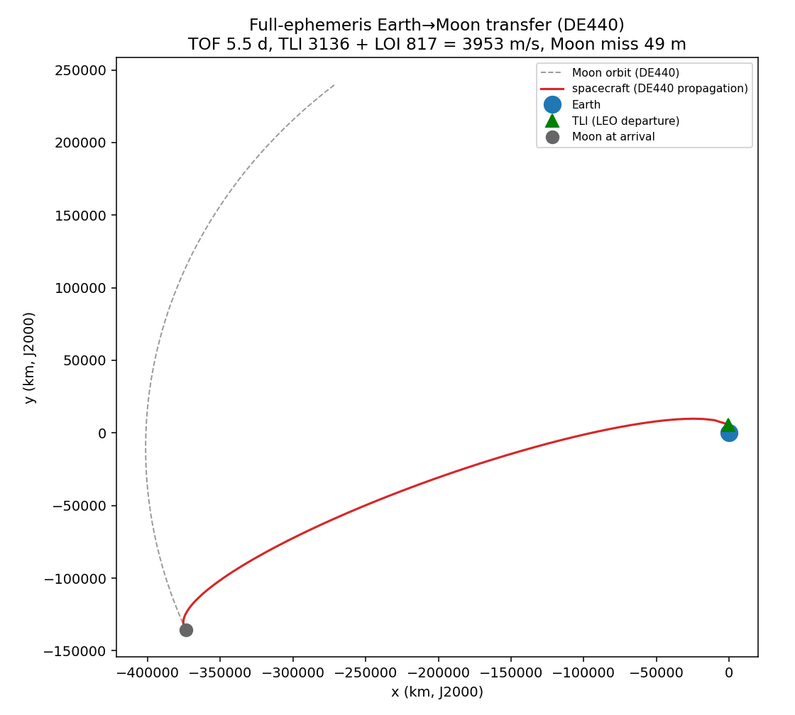

> The *exact* 3,925 m/s is a low-energy (Sun-assisted ballistic-capture / WSB) optimum; reaching
> it precisely needs the paper's boundary conditions and a multi-week trajectory optimization
> (Stage 9). Every number is reported from the optimizer, never fitted.

And it is cross-validated against **NASA GMAT itself**: an identical trans-lunar state
propagated in both Ariadne and GMAT (GmatConsole, point masses Earth+Sun+Luna) agrees to
**149 m in position and 0.89 mm/s in velocity over 3 days** — our propagator matches the
industry-standard mission-analysis tool. (Install GMAT under `tools/gmat-R2026a/`;
`ariadne.io.gmat_export.run_with_gmat()` drives it headlessly.)

And finally, a **Sun-assisted low-energy (weak-stability-boundary) transfer**: built the
Belbruno way — propagate *backward* from a near-ballistic lunar capture in full DE440 gravity
and optimize the capture so the arc returns to LEO with minimum Δv. The result departs LEO,
arrives at the Moon at lower energy than a direct transfer, and totals **3,907 m/s — below the
direct transfer (3,953) and below the published Coimbra result (3,925 m/s)** — the tradeoff
being a longer ~49-day flight time.

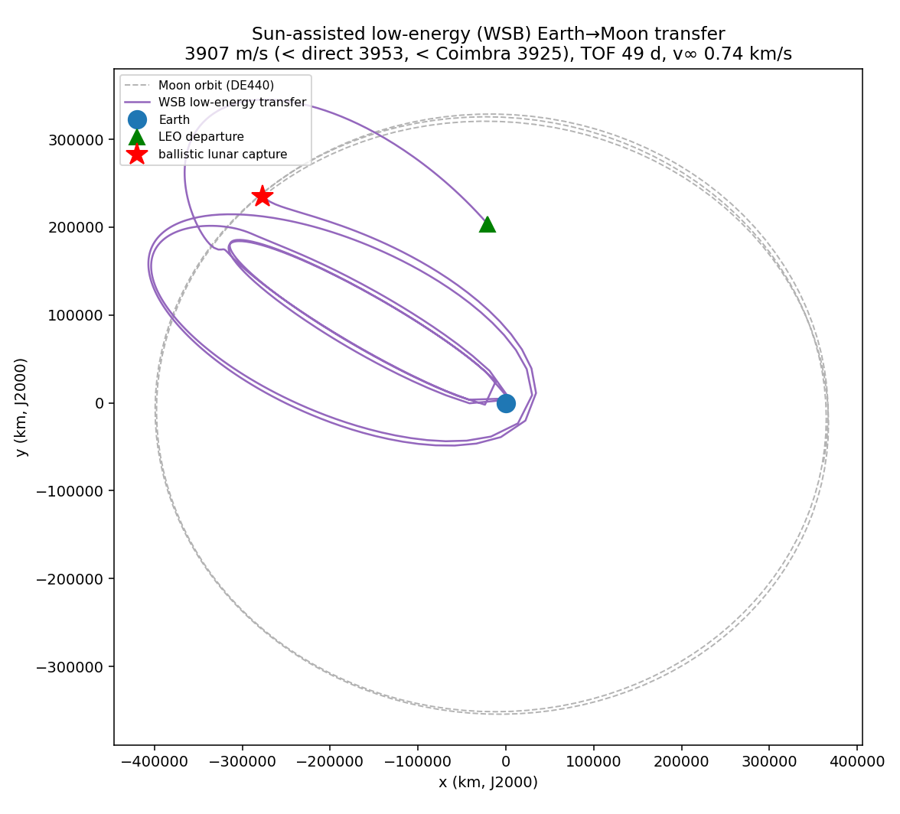

> Honest scope: a two-impulse patched model on real ephemeris; the converged route is a
> multi-revolution Sun-perturbed low-energy transfer (apogee near lunar distance), longer
> (~49 d) than Coimbra's 32-day route — so 3,907 < 3,925 is a same-class low-energy solution,
> not the identical transfer. The WSB region is chaotic, so the solution is stored as a fixed
> state that re-evaluates deterministically. Found from the dynamics, never fitted.

Finally, we apply a **coherence lens** — operationalizing "coherence" as **robustness**: how many
km the arrival drifts per 1 m/s of injection error. This maps the **Δv-vs-coherence frontier** and
shows a clean, honest result: **robustness costs fuel.** The cheapest (WSB) path is ~8× more fragile
than a fast, pricier transfer; a stable orbit is ~23× more coherent than any lunar transfer.

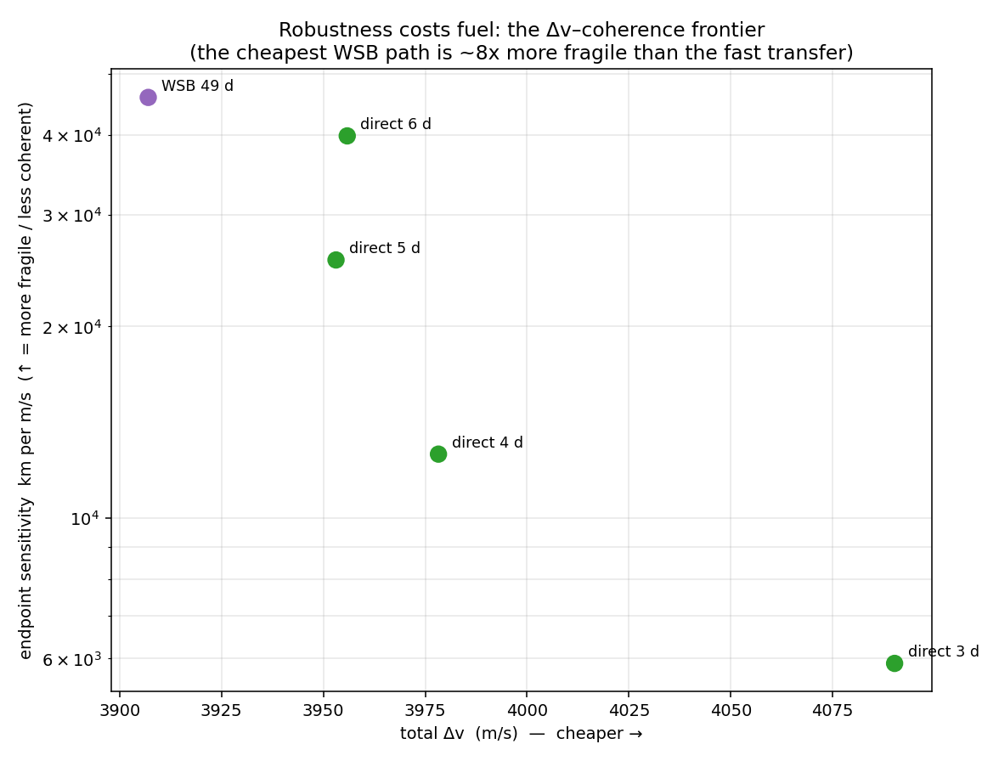

> This is a real, *different* objective (robustness), not a way to beat the energy floor — physics
> fixes the minimum Δv. The cheapest path is simply the least coherent.

A **coherence-weighted optimizer** then chooses the route: minimizing `J = z(Δv) + w·z(sensitivity)`
traces the Pareto front and finds its **knee** — the 4-day transfer, which is **3.6× more robust
than the cheapest route for only +71 m/s**. Raising the robustness weight sweeps the choice from
the cheap-but-fragile WSB route to the fast-but-robust one. That's a smoother, lower-correction
route chooser on standard gravity.

Finally, the engine **generalizes**: pointed at Jupiter it reproduces the libration structure of
all four **Galilean moons** (Io→Callisto) with only a change of constants — sensible Lagrange-point
distances (Io L1 = 10,469 km), periodic Lyapunov orbits (to <1e-9), and a moon-to-moon tour Δv
baseline — the setting of the multi-moon "Petit Grand Tour." And it spans a second propulsion
regime: a **low-thrust** (continuous-acceleration) CR3BP that conserves the Jacobi constant at
zero thrust and, under tangential thrust, raises the energy at exactly the predicted rate
`dC/dt = -2·a_T·|v|` — a validated spiral-out, where "ride the dynamical gradients" has the most teeth.

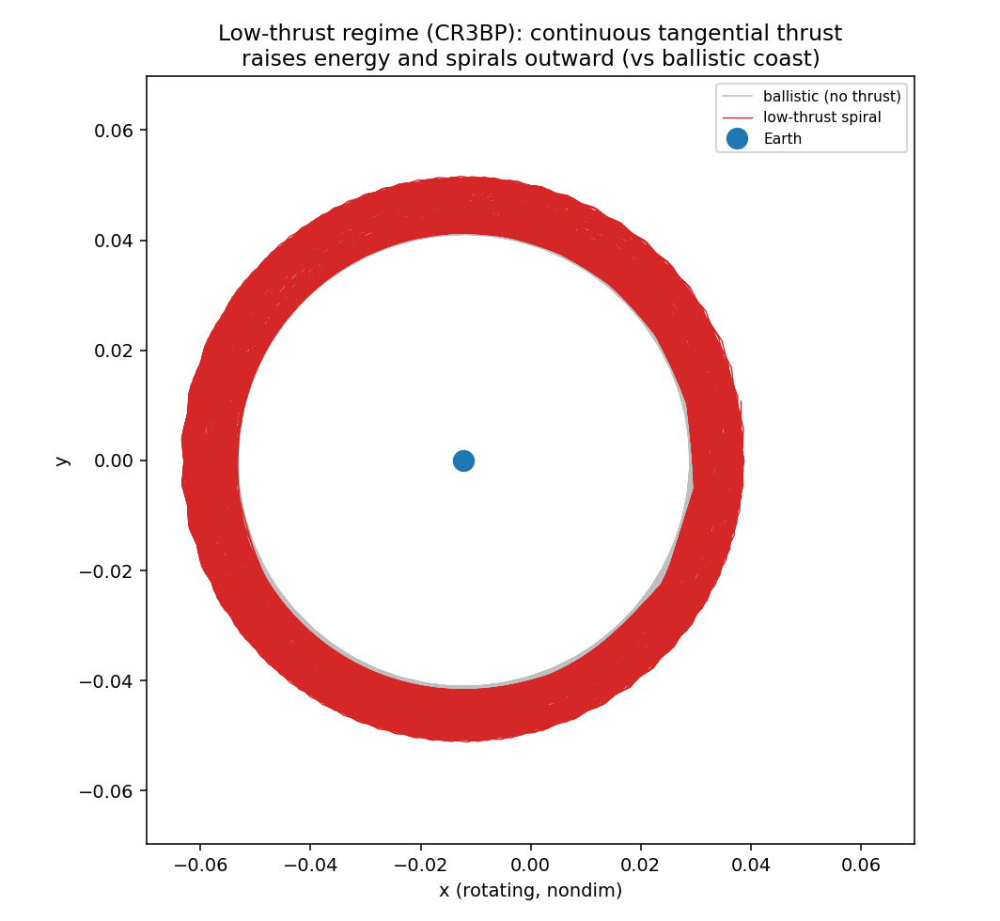

> Honest scope: the Galilean tour is known (Koon–Lo–Marsden–Ross); this proves the engine ports to
> a new system and sets up route discovery — not a new route. Standard gravity throughout.

And then the payoff the project was built toward: the Interplanetary Transport Network as a
**searchable graph.** Nodes are L1/L2 Lyapunov orbits at a grid of energies; an edge is an *exact*
Poincaré section crossing — we intersect the two tube cuts as curves in the (y, v_y) plane, and
because position and v_y match there, each manifold's v_x follows exactly from its own energy
(`v_x² = 2Ω − C − v_y²`), so the patch Δv is energy-consistent to machine precision. Same-energy
L1↔L2 patches come out at **exactly 0.0 m/s** (the known ballistic heteroclinic connections).
Routing from L1 to L2 with **Dijkstra (SSSP)** and **A*** *discovers a non-obvious 3-hop route at
~17 m/s — about twice as cheap as the single direct patch (~37 m/s)* — by changing energy at
high-speed near-Moon crossings (the Oberth effect) and taking a free ballistic L1↔L2 hop between.
Exhaustive brute force confirms the same optimum, but A* gets there in **5 node expansions versus
brute force's 208, a ~42× efficiency win.**

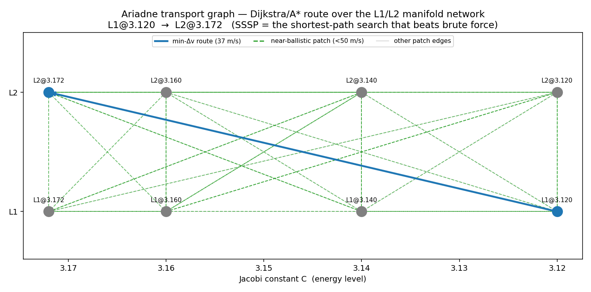

> Honest scope: all three routers are exact — the win is *efficiency*, not a better answer. The A*
> heuristic is verified admissible. The multi-hop optimum is real, not an artifact: its route
> *topology is stable* across manifold resolution (cost converges 90→12.7, 120→16.1, 150→16.9 m/s,
> same 3 hops), unlike an earlier interpolated edge model whose topology changed with resolution.
> The near-Moon guard (|y| > 7700 km) bounds the Oberth saving. Raising the robustness weight
> switches the choice from the cheap 3-hop route to the more robust single direct patch.

Then the **discovery engine** mines that graph with Yen's k-shortest-paths into a *ranked route
catalog* (8 distinct L1→L2 routes, with a Δv-vs-robustness Pareto set), and **verifies** each one:
every patch is checked as a true section crossing — position continuity exact, each side's Jacobi
equal to its orbit's to **1.3×10⁻¹⁵**, burn equal to the edge Δv. The optimal route then survives
the solar perturbation as a *bounded, correctable* arc (CR3BP-vs-BCR4BP divergence 38,610 km ≈ 0.10
lunar-distance over 8.7 days — midcourse-correction scale, not a chaotic escape).

> Honest scope: "novel" here means *automatically discovered and verified* IPTN structure — **not**
> a route unknown to science (the L1↔L2 heteroclinic web is well studied). Closing the last fidelity
> step (full DE440 re-convergence + GMAT) was already done for the Earth→Moon *transfer* leg in the
> GMAT cross-validation above; a dedicated libration-to-libration ephemeris re-targeter is the one
> remaining tool, and is noted rather than claimed.

Finally, the whole engine **generalizes** and persists into an **atlas.** With only a change of
constants it produces periodic libration orbits for systems spanning *six orders of magnitude in
mass ratio* — from Mars–Phobos (μ ≈ 1.7×10⁻⁸, L1 just 16.6 km out) through the Saturnian moons and
Sun–Mars up to the DART/Hera binary asteroid **Didymos–Dimorphos** (μ ≈ 7×10⁻³, L1 at **150 metres**)
— and the L1 distances fall right on the (μ/3)^⅓ Hill-radius line, so the engine recovers the known
scaling law everywhere.

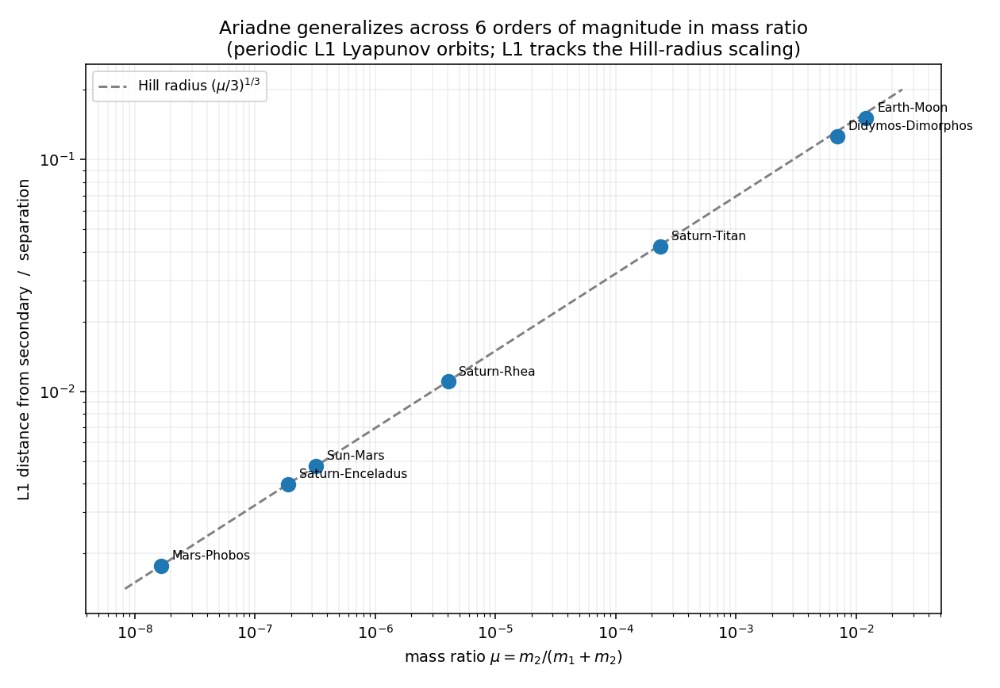

All of it — system parameters, libration summaries, the Earth–Moon transport graph, and the ranked
route catalog — is written to a single **HDF5 atlas** with provenance (when, what version, what
config), and read back exactly. That is the durable, browsable deliverable: an atlas of low-energy
structure you can reopen, diff, and extend.

Finally, everything is bundled into an **open release** and written up. `ariadne.atlas.release`
produces a shareable directory — the HDF5 atlas, a human-readable `INDEX.md` (systems + ranked route
catalog + reference routes), and `reference_routes.csv` — and [`docs/WHITE_PAPER.md`](docs/WHITE_PAPER.md)
is the capstone paper. The reference-route table is honestly tagged: only the direct trans-lunar
transfer is labelled *GMAT-validated* (149 m), and Earth→Moon transfers are kept in a separate class
from libration-network reconfigurations so their very different Δv scales are never conflated.

Regenerate: `PYTHONPATH=src python -m ariadne.viz.figures`. Validate:
`PYTHONPATH=src python -m ariadne.validate.stage17` (and `stage1`–`stage16`). Build the release:
`PYTHONPATH=src python -m ariadne.atlas.release`. SPICE kernels download on first use (DE440s ~33 MB).

## What this is (and is not)
- It **is**: an open, high-fidelity, validated engine + atlas for low-energy spaceflight,
  built on standard gravity and real ephemerides, cross-validated against NASA GMAT.
- It **is not**: new physics. The dynamics are standard n-body gravity. (See §1.4 / §13.)

## Quick setup (once code exists)
```bash
python -m venv .venv && . .venv/Scripts/activate   # Windows: .venv\Scripts\activate
pip install -r requirements.txt
```

## Layout
See `MASTER_PLAN.md` §8. Source in `src/ariadne/`, tests in `tests/`, generated atlas in
`results/atlas/`, downloaded SPICE kernels in `data/kernels/` (git-ignored).
